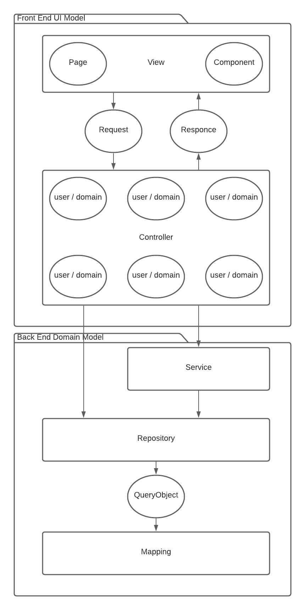

# Course Scheduling System (CSS) - REGIE
A console interaction app for course scheduling

## Introduction
This project is trying to use pure JAVA code without any ORM and web development tools to mimic a full-stack web 
application of a course scheduling system. Here is the structure.

## Usage
Please use an IDE to run this program.

## Note
Use "regie" as user id to login. (Four character id and id with >= 6 
characters are also work, for department admin and instructor respectively, though not being functionalized.) 

Although this project only has one functionality, I do spend a great amount of time and OOP practice into the 
construction of the whole project.